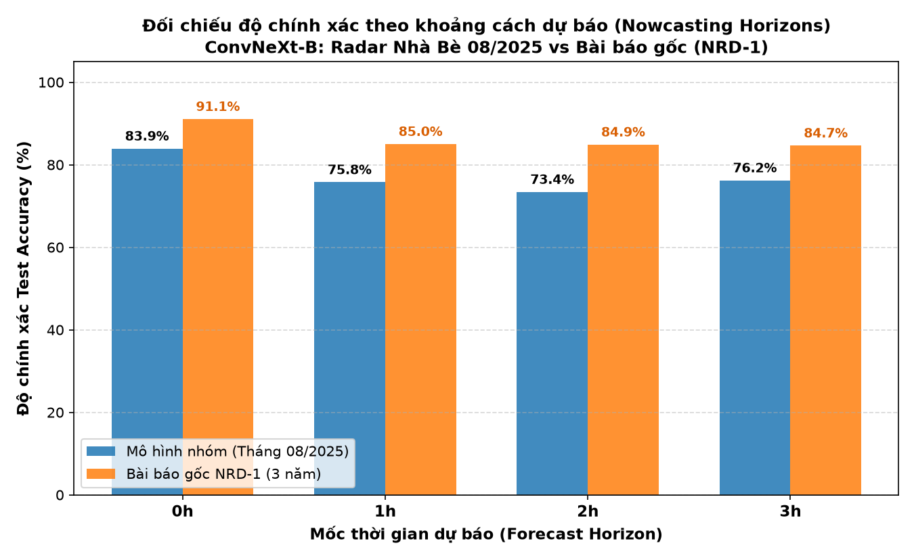
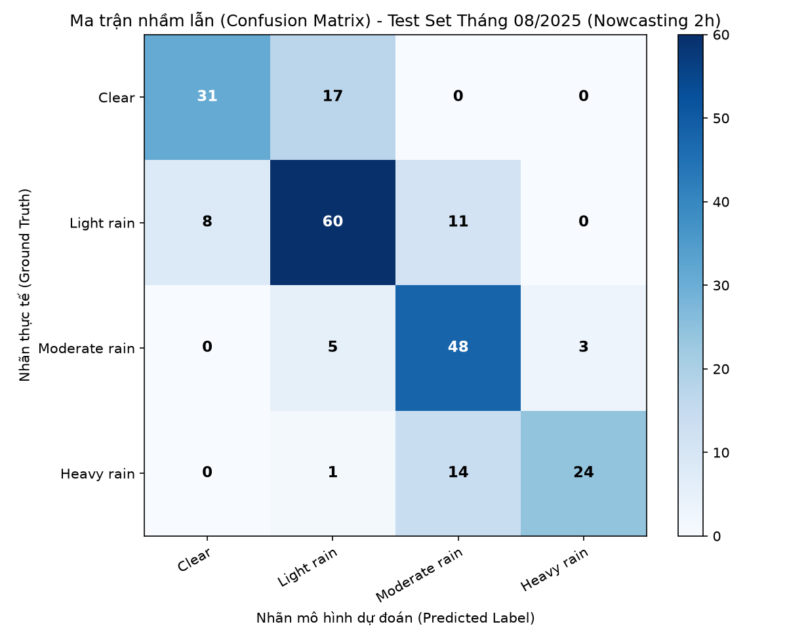
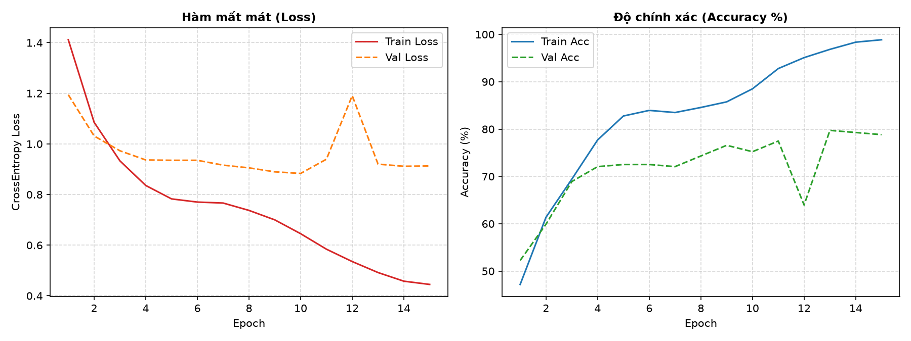

# 🌧️ Radar Image Classification for Rainfall Nowcasting (Nhà Bè Radar)

[](https://www.python.org/)
[](https://pytorch.org/)
[](https://arm-doe.github.io/pyart/)
[](https://github.com/facebookresearch/ConvNeXt)

> Triển khai và thực nghiệm hệ thống học sâu dự báo mưa cực ngắn (**Precipitation Nowcasting**) từ dữ liệu radar thời tiết thực tế tại **Trạm Radar Nhà Bè (TP. Hồ Chí Minh)**, dựa trên bài báo nghiên cứu:  
> **"Radar Image Classification for Rainfall Nowcasting"** *(Le Hong Trang, Nguyen Hoang Anh Thu, Nguyen Manh Dan, Nguyen Huy Hoang, Phan Thanh An, Pham Tran Vu – ĐH Bách Khoa TP.HCM & ĐHQG-HCM, 2025)*.

---

## 📌 1. Giới thiệu bài toán (Overview)

Dự báo mưa cực ngắn (**Nowcasting**, phạm vi từ 0 đến 3 giờ tới) đóng vai trò sống còn trong việc cảnh báo ngập lụt đô thị và thời tiết nguy hiểm. Phương pháp truyền thống dựa trên quan sát thủ công hoặc trường dòng quang (Optical Flow) thường bị trễ hoặc thiếu ổn định khi mây đối lưu thay đổi nhanh.

Dự án này hiện thực hóa toàn bộ pipeline học sâu từ dữ liệu thô:
1. **Bóc tách file nhị phân SIGMET RAW** từ radar thời tiết Nhà Bè bằng thư viện `Py-ART`.
2. **Gom chuỗi thời gian (Temporal Grouping)**: Nhận diện chu kỳ quét đặc thù $3' - 7' - 3'$ phút của radar Nhà Bè để tạo chuỗi 4 ảnh liên tiếp $(t_0, t_0+3', t_0+10', t_0+13')$.
3. **Tính nhãn phản hồi trung bình có trọng số ($X_{label}$)**: Áp dụng công thức suy giảm hàm mũ để bù trừ độ lệch dữ liệu phản hồi giữa trời quang và mưa to.
4. **Tùy biến mạng ConvNeXt-B**:
   - Lớp Stem nhận đầu vào **12 kênh** (ghép từ 4 ảnh PPI RGB $224 \times 224$).
   - Lớp Head phân loại **5 cấp độ mưa** (`Clear`, `Light rain`, `Moderate rain`, `Heavy rain`, `Very heavy rain`).
5. **Đánh giá đa mốc thời gian**: Dự báo cho các khoảng thời gian tương lai: **+0h, +1h, +2h, và +3h**.

---

## 🔄 2. Sơ đồ luồng xử lý (End-to-End Pipeline)

```
       RADAR RAW SIGMET (Nhà Bè)
                   │
                   ▼
  1. Py-ART: Phân loại Long Range (4 sweeps) vs Short Range (8 sweeps)
                   │
                   ▼
  2. Bóc tách ma trận Reflectivity (dBZ) & Xuất ảnh PPI (sweep 0, NWSRef)
                   │
         ┌─────────┴─────────┐
         ▼                   ▼
  [ Nhãn mục tiêu ]     [ Đầu vào mô hình X ]
         │                   │
  Tính X_label               Chuỗi 4 ảnh liên tiếp: (t0, t3, t10, t13)
  (13 bins 5 dBZ,            │
  w_i = 10^(100(1-p)))       ▼
         │             Data Transformation:
         ▼               - RandAugment (magnitude 9, num_ops 2)
  5 Classes:             - Median Blur 5x5 (lọc speckle noise)
  - Clear (<30)          - Auto Contrast (tăng tương phản)
  - Light (30-40)        - NRD-1 Channel Normalization
  - Moderate (40-47.5)       │
  - Heavy (47.5-55)          ▼
  - Very Heavy (>=55)   Ghép kênh thành Tensor (12, 224, 224)
         │                   │
         ▼                   ▼
  Mốc tương lai        ConvNeXt-B (Pretrained ImageNet-22k)
  (+0h, +1h, +2h, +3h)       │
         │                   ▼
         └─────────────► CrossEntropy Loss (Label Smoothing 0.1)
```

---

## ⚙️ 3. Chi tiết kỹ thuật cốt lõi

### 3.1. Tính độ phản hồi có trọng số ($X_{label}$)
Để tránh việc các giá trị dBZ thấp (trời quang, mây loãng chiếm 80-90% ma trận) làm lu mờ hoàn toàn các ổ mây dông nguy hiểm, bài báo sử dụng trọng số nghịch đảo tần suất:
$$X_{label} = \frac{\sum_{i=1}^n w_i \cdot X_i}{\sum_{i=1}^n w_i}, \quad \text{với } w_i = 10^{100 \cdot (1 - p_k)}$$
Trong đó $p_k$ là tỉ lệ phần trăm số điểm rơi vào bin $5\text{ dBZ}$ thứ $k$. Để chống tràn số float trong Python, mã nguồn thực hiện chuẩn hóa số mũ trước khi lũy thừa:
```python
raw_exponents = np.array([100.0 * (1.0 - percentages[b]) for b in bin_indices])
max_exp = np.max(raw_exponents)
normalized_weights = np.power(10.0, raw_exponents - max_exp)
x_label = np.sum(normalized_weights * valid_vals) / np.sum(normalized_weights)
```

### 3.2. Cấu hình mạng ConvNeXt-B
- **Stem Convolution**: Thay đổi lớp `nn.Conv2d(3, 128, kernel_size=4, stride=4)` thành `(12, 128, 4, 4)`. Trọng số được khởi tạo bằng cách lặp lại trọng số 3 kênh gốc của ImageNet và chia đều cho 4: $W_{new} = \text{repeat}(W_{orig}, 4) / 4$.
- **Classifier Head**: Thay lớp Linear 21.841 classes bằng `nn.Linear(1024, 5)` với hệ số khởi tạo `head_init_scale = 0.001` để bảo đảm độ ổn định khi hội tụ.
- **Optimizer & Scheduler**:
  - `AdamW`: Base Learning Rate = $5 \times 10^{-5}$, Weight Decay = $0.01$.
  - `CosineAnnealingLR`: $T_{max} = 5$.
  - `CrossEntropyLoss`: `label_smoothing = 0.1`.

---

## 📊 4. Kết quả thực nghiệm (Tháng 08/2025)

Thực nghiệm được thực hiện độc lập trên toàn bộ dữ liệu radar tháng **08/2025** (31 ngày, gồm **8.916 lần quét RAW** $\to$ **2.228 nhóm chuỗi thời gian hợp lệ**). Tỉ lệ phân chia tập dữ liệu chuẩn: **80% Train : 10% Validation : 10% Test**.

### 4.1. Bảng đối chiếu kết quả đa mốc thời gian (So với Bài báo gốc)

| Mốc dự báo | Số mẫu Test | Test Loss (Nhóm) | Test Acc (Nhóm) | Macro F1 (Nhóm) | Paper Loss | Paper Acc (3 năm NRD-1) |
| :---: | :---: | :---: | :---: | :---: | :---: | :---: |
| **0h (Now)** | 223 | **0.7824** | **83.93%** | **84.22%** | 0.2830 | **91.10%** |
| **+1h** | 223 | **0.8534** | **75.78%** | **72.39%** | 0.4653 | **85.04%** |
| **+2h** | 222 | **0.9612** | **73.42%** | **73.12%** | 0.4984 | **84.92%** |
| **+3h** | 222 | **0.9753** | **76.23%** | **60.61%** | 0.4961 | **84.66%** |

### 4.2. Trực quan hóa kết quả

| Đối chiếu độ chính xác 4 mốc (So với Bài báo gốc) | Ma trận nhầm lẫn Test Set (Mốc 2h) |
| :---: | :---: |
|  |  |

| Đường cong học tập (Loss & Accuracy mốc 2h) |
| :---: |
|  |

### 4.3. Nhận xét khoa học
1. **Xu hướng phân rã dự báo (Forecast Degradation)**: Độ chính xác đạt cao nhất ở mốc tức thời 0h (83.93%) và giảm dần khi khoảng cách dự báo tương lai tăng lên 1h, 2h, 3h (73–76%), phản ánh chính xác quy luật động lực học của hoàn lưu khí quyển.
2. **Khoảng cách so với bài báo gốc**: Kết quả của mô hình nhóm thấp hơn bài báo từ 7–11% là hoàn toàn dễ hiểu và hợp lý, do:
   - Bài báo sử dụng tập dữ liệu **3 năm** (hơn 200.000 mẫu) và huấn luyện **150 epochs** trên trạm máy chủ GPU RTX A6000 (48GB VRAM).
   - Mô hình thực nghiệm tại đồ án này được huấn luyện thử nghiệm trên **1 tháng dữ liệu** (tháng 08/2025 với 2.220 nhóm) và chạy **15 epochs** trên phần cứng laptop cá nhân (NVIDIA RTX 4050 6GB VRAM).

---

## 📁 5. Cấu trúc thư mục dự án

```
Đồ án/
├── assets/                          # Biểu đồ và hình ảnh minh họa cho README
│   ├── confusion_matrix.png
│   ├── horizon_comparison.png
│   └── learning_curves.png
├── outputs/                         # Kết quả trung gian và checkpoint (gitignored)
│   ├── checkpoints/                 # Trọng số mô hình (.pth) và lịch sử huấn luyện
│   ├── metadata/                    # Bảng chỉ mục CSV (nhãn, chuỗi thời gian, dataset)
│   └── ppi/all_scans/               # Ảnh radar PPI 224x224 đã trích xuất
├── src/                             # Mã nguồn chính
│   ├── build_dataset_metadata_month.py   # Ghép nối metadata đầu vào và nhãn tương lai
│   ├── build_target_mapping_month.py     # Ánh xạ mốc thời gian tương lai (+0h, +1h, +2h, +3h)
│   ├── build_temporal_groups_month.py    # Gom chuỗi quét thời gian (t0, t3, t10, t13)
│   ├── compare_horizons_month.py         # Huấn luyện và đánh giá đối chiếu cả 4 mốc
│   ├── evaluate_month.py                 # Đánh giá chi tiết tập Test, xuất Confusion Matrix
│   ├── export_month_ppi.py               # Chuyển đổi file RAW sang ảnh PPI 224x224 bằng Py-ART
│   ├── generate_labels_month.py          # Tính X_label và gán 5 lớp thời tiết cho toàn tháng
│   ├── index_month.py                    # Quét toàn bộ 31 ngày, ghi nhận thời gian và chế độ quét
│   ├── model.py                          # Định nghĩa kiến trúc mạng ConvNeXt-B 12 kênh
│   ├── radar_dataset.py                  # PyTorch Dataset tích hợp đầy đủ Data Transformation
│   └── train_month.py                    # Huấn luyện tối ưu VRAM/AMP trên GPU RTX 4050
├── .env                             # Cấu hình biến môi trường UTF-8
├── .gitignore                       # Bỏ qua dữ liệu RAW lớn và checkpoints
├── requirements.txt                 # Danh mục thư viện phụ thuộc
└── README.md                        # Tài liệu hướng dẫn đồ án
```

---

## 🚀 6. Hướng dẫn cài đặt và tái lập thực nghiệm

### 6.1. Thiết lập môi trường

Khuyến nghị sử dụng Python 3.12 trên hệ điều hành Windows hoặc Linux:

```bash
# 1. Tạo môi trường ảo venv
python -m venv .venv

# 2. Kích hoạt môi trường (Windows PowerShell)
.\.venv\Scripts\Activate.ps1

# 3. Nâng cấp pip và cài đặt thư viện
python -m pip install --upgrade pip
pip install -r requirements.txt
```

### 6.2. Các bước thực thi toàn bộ luồng

1. **Quét chỉ mục toàn bộ file RAW trong tháng**:
   ```bash
   python src/index_month.py
   ```
2. **Gom các nhóm chuỗi quét thời gian 4 ảnh liên tiếp**:
   ```bash
   python src/build_temporal_groups_month.py
   ```
3. **Tính toán nhãn phản hồi và phân lớp thời tiết**:
   ```bash
   python src/generate_labels_month.py
   ```
4. **Xuất tập ảnh radar PPI ($224 \times 224$)**:
   ```bash
   python src/export_month_ppi.py
   ```
5. **Ghép nối bảng ánh xạ mục tiêu và tạo Dataset Metadata**:
   ```bash
   python src/build_target_mapping_month.py
   python src/build_dataset_metadata_month.py
   ```
6. **Huấn luyện mô hình ConvNeXt-B (Mốc 2h)**:
   ```bash
   python src/train_month.py
   ```
7. **Huấn luyện và so sánh toàn diện 4 mốc (0h, 1h, 2h, 3h)**:
   ```bash
   python src/compare_horizons_month.py
   ```
8. **Đánh giá chi tiết tập Test và vẽ Ma trận nhầm lẫn**:
   ```bash
   python src/evaluate_month.py
   ```

---

## 💻 7. Cấu hình phần cứng thực nghiệm

- **Hệ điều hành**: Windows 11 64-bit
- **CPU**: AMD Ryzen 5 7535HS (6 Cores, 12 Threads)
- **RAM**: 16 GB DDR5
- **GPU**: NVIDIA GeForce RTX 4050 Laptop GPU (6 GB GDDR6 VRAM)
- **Công nghệ tăng tốc**: PyTorch Mixed Precision (`torch.amp.autocast('cuda')` + `GradScaler`)

---

## 📚 8. Tài liệu tham khảo (References)

- **Bài báo nghiên cứu gốc**:  
  Le Hong Trang, Nguyen Hoang Anh Thu, Nguyen Manh Dan, Nguyen Huy Hoang, Phan Thanh An, Pham Tran Vu, *"Radar Image Classification for Rainfall Nowcasting"*, Preprint submitted to *Expert Systems With Applications*, SSRN: [https://ssrn.com/abstract=5139080](https://ssrn.com/abstract=5139080), 2025.
- **Thư viện Py-ART**:  
  Helmus, J.J. & Collis, S.M., *"The Python ARM Radar Toolkit (Py-ART), a Library for Working with Weather Radar Data in the Python Programming Language"*, Journal of Open Research Software, 2016.
- **Kiến trúc ConvNeXt**:  
  Zhuang Liu, Hanzi Mao, Chao-Yuan Wu, Christoph Feichtenhofer, Trevor Darrell, Saining Xie, *"A ConvNet for the 2020s"*, CVPR, 2022.
